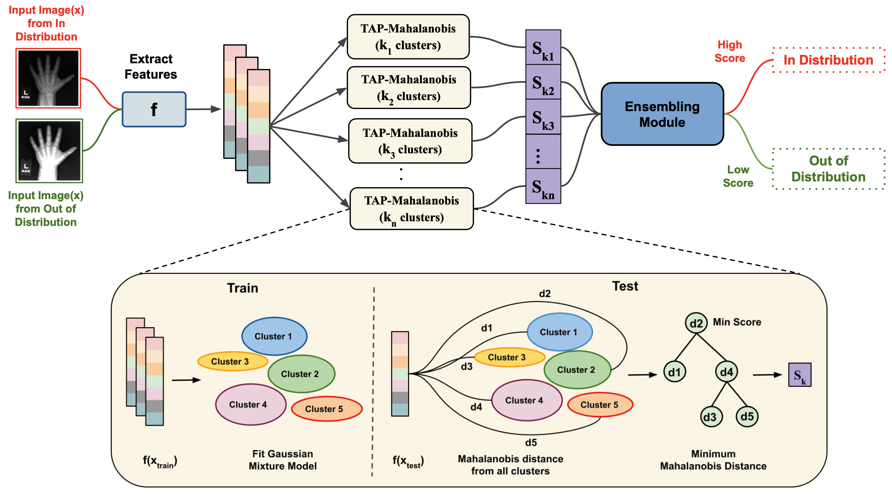

# Task Agnostic and Post-hoc </br> Unseen Distribution Detection
This is the official *Pytorch Implementation* for the paper [Task Agnostic and Post-hoc Unseen Distribution Detection](https://arxiv.org/abs/2207.13083). It currently includes code multi-class classification, binary classification, regression.

**Authors**: [_Radhika Dua_](https://radhikadua123.github.io), [_Seongjun Yang_](https://scholar.google.com/citations?user=OxSABfkAAAAJ&hl=ko), [_Yixuan Li_](https://pages.cs.wisc.edu/~sharonli/), [_Edward Choi_](https://mp2893.com)

## Abstract
Despite the recent advances in out-of-distribution(OOD) detection, anomaly detection, and uncertainty estimation tasks, there do not exist a task-agnostic and post-hoc approach.
To address this limitation, we design a novel clustering-based ensembling method, called **T**ask **A**gnostic and **P**ost-hoc **U**nseen **D**istribution **D**etection (TAPUDD) that utilizes the features extracted from the model trained on a specific task. Explicitly, it comprises of *TAP-Mahalanobis*, which
clusters the training datasets' features and determines the minimum Mahalanobis distance of the test sample from all clusters. Further, we propose the *Ensembling module*
that aggregates the computation of iterative TAP-Mahalanobis for a different number of clusters 
to provide reliable and efficient cluster computation.
Through extensive experiments on synthetic and real-world datasets, we observe that our approach can detect unseen samples effectively across diverse tasks and performs better or on-par with the existing baselines. To this end, we eliminate the necessity of determining the optimal value of the number of clusters and demonstrate that our method is more viable for large-scale classification tasks.

__Contribution of this work__
- We propose a novel task-agnostic and post-hoc approach, **TAPUDD**, to detect unseen samples across diverse tasks like classification, regression, etc. 
- For the first time, we empirically show that a single approach can be used for multiple tasks with stable performance. We conduct exhaustive experiments on synthetic and real-world datasets for regression, binary classification, and multi-class classification tasks to demonstrate the effectiveness of our method.
- We also conduct ablation studies to illustrate the effect of using a different number of clusters in *TAP-Mahalanobis* and different ensembling strategies in TAPUDD. We observe that TAPUDD with different ensembling strategies performs better or on-par with *TAP-Mahalanobis*.

## Method
We propose a novel, **T**ask **A**gnostic and **P**ost-hoc **U**nseen **D**istribution **D**etection (TAPUDD) method, as shown in figure below. The method comprises of two main modules TAP-Mahalanobis and Ensembling.



## Prerequisites
### Loading the environment

Make sure you have Anaconda installed before you create and activate this environment.

```
conda env create -f environment.yml
conda activate conda_env_tapudd
```


## Experiments and Results
Code and details for the experiments on synthetic datasets, binary classification, multi-class classification, and regression are inside the respective folders:

- [Synthetic datasets](https://github.com/Radhikadua123/TAG/tree/main/synthetic_2d_binary_classification)
- [Binary classification task](https://github.com/Radhikadua123/TAG/tree/main/binary_classification)
- [Multi-class classification task](https://github.com/Radhikadua123/TAG/tree/main/multi_class_classification)
- [Regression task]()

Each of these are independent repositories. Please consider them separate. 

## Contributing
We'd love to accept your contributions to this project. Please feel free to open an issue, or submit a pull request as necessary. 
