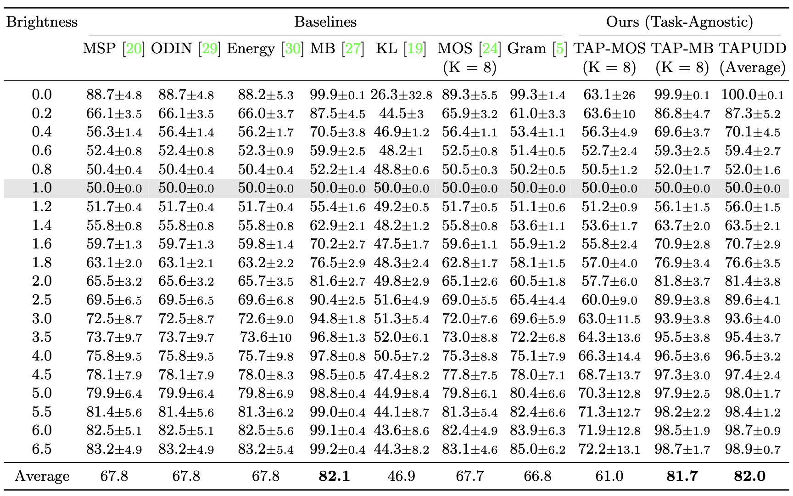

# Experiments on Binary classification

Please download the [dataset](https://www.kaggle.com/datasets/kmader/rsna-bone-age) and use it's path in all the scripts. We stored the data in `/home/data_storage/ood_datasets/data/datasets/boneage_data_kaggle/`.

## Training and testing the gender classification model

To train the gender classification model and test it on the ID test set and NAS datasets, please please modify `/home/data_storage/ood_datasets/data/datasets/boneage_data_kaggle/` with dataset path and run:

```
bash ./scripts/train.sh /home/data_storage/ood_datasets/data/datasets/boneage_data_kaggle/
```

Model weights will be stored in `results/models/` and results will be stored in `results/logs/`.

## OOD Detection Evaluation

To reproduce our TAP-Mahalanobis and TAP-Ensemble results, please modify `/home/data_storage/ood_datasets/data/datasets/boneage_data_kaggle/` with dataset path and run the following commands for feature extraction followed by ood fetection using TAP-Mahalanobis and TAPUDD:
```
bash ./scripts/get_penultimate_features.sh /home/data_storage/ood_datasets/data/datasets/boneage_data_kaggle/
bash ./scripts/test_tap_mahalanobis_nas.sh 
bash ./scripts/test_tapudd.sh 
```

To reproduce baseline approaches (MSP, ODIN, Energy, Mahalanobis, KL_Div), please modify `/home/data_storage/ood_datasets/data/datasets/boneage_data_kaggle/` with dataset path and run:
```
bash ./scripts/test_baselines_nas.sh MSP(/ODIN/Energy/Mahalanobis/KL_Div) /home/data_storage/ood_datasets/data/datasets/boneage_data_kaggle/
```

To reproduce MOS, please run:
```
bash ./scripts/test_mos.sh
```

Note: before testing Mahalanobis, make sure you have tuned and saved its hyperparameters first by running:
```
bash ./scripts/tune_mahalanobis.sh /home/data_storage/ood_datasets/data/datasets/boneage_data_kaggle/
```

## OOD Detection Results

### Results
NAS detection performance in binary classification task (gender prediction)for NAS shift of brightness in RSNA boneage dataset measured by AUROC. Highlighted row presents the performance on in-distribution dataset. MB and TAP-MB refers to Mahalanobis and TAP-Mahalanobis, respectively. Our proposed approaches, TAPUDD and TAP-Mahalanobis are more sensitive to NAS samples compared to competitive baselines.


