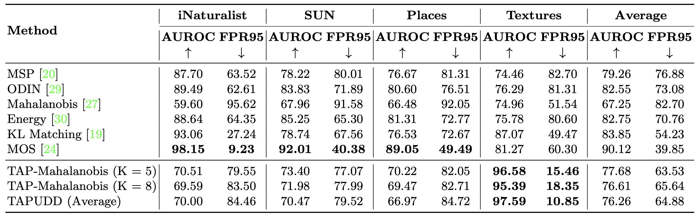
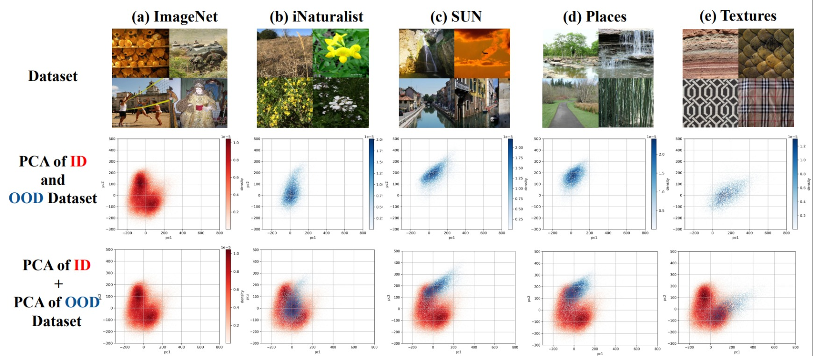

# Experiments on Multi-class classification

We use the datasets and code from [this](https://github.com/deeplearning-wisc/large_scale_ood) repository for training the model for classification task and for the baseline OOD detection methods. Please refer to the aforementioned repository for information on dataset and pretrained model preparation.

## Group-softmax/Flat-softmax Model Finetuning

For flat-softmax finetuning (TAPUDD, TAP-Mahalanobis and baselines), please run:

```
bash ./scripts/finetune_flat_softmax.sh
```

For group-softmax finetuning (MOS), please run:

```
bash ./scripts/finetune_group_softmax.sh
```


## OOD Detection Evaluation

To reproduce our TAP-Mahalanobis and TAP-Ensemble results, please run the following commands for feature extraction followed by :
```
bash ./scripts/get_features.sh iNaturalist(/SUN/Places/Textures)
bash ./scripts/test_ours.sh 
bash ./scripts/test_ours_ensemble.sh 
```

To reproduce baseline approaches (MSP, ODIN, Energy, Mahalanobis, KL_Div), please run:
```
bash ./scripts/test_baselines.sh MSP(/ODIN/Energy/Mahalanobis/KL_Div) 
```

To reproduce MOS, please run:
```
bash ./scripts/test_mos.sh
```

Note: before testing Mahalanobis, make sure you have tuned and saved its hyperparameters first by running:
```
bash ./scripts/tune_mahalanobis.sh
```

## OOD Detection Results

### Results
OOD detection performance comparison between TAPUDD method and baselines. Our method detects samples from Textures more OOD compared to samples from iNaturalist, SUN, Places (similar to the way humans perceive).



### Analysis
***(top)*** Examples of ID images sampled from Imagenet and OOD images sampled from iNaturalist, SUN, Places, and Textures dataset; ***(middle)*** Point-density based PCA visualization to demonstrate the location and density of ID and OOD datasets; ***(bottom)*** Point-density based PCA visualization of ID dataset overlapped by PCA of different OOD datasets to demonstrate the location and density of different OOD datasets relative to the ID dataset. Dataset images ***(top)*** and PCA ***(bottom)*** demonstrates that Textures is more different from Imagenet than other three OOD datasets.

